## Contents
{:.no_toc}
*  
{: toc}

### Loading Library


```python
import numpy as np
import pandas as pd
import matplotlib
import matplotlib.pyplot as plt
from sklearn.linear_model import LogisticRegressionCV
import sklearn.metrics as metrics
from sklearn.preprocessing import PolynomialFeatures
from sklearn.discriminant_analysis import LinearDiscriminantAnalysis
from sklearn.discriminant_analysis import QuadraticDiscriminantAnalysis
from sklearn.neighbors import KNeighborsClassifier
from sklearn.tree import DecisionTreeClassifier
from sklearn.model_selection import cross_val_score
from sklearn.model_selection import KFold
from sklearn.model_selection import GridSearchCV
from sklearn import tree
from sklearn.metrics import confusion_matrix
from sklearn.metrics import roc_curve, auc, roc_auc_score
import json
from sklearn.tree import export_graphviz
from IPython.display import Image
from IPython.display import display

%matplotlib inline

import warnings
warnings.filterwarnings('ignore')

pd.set_option('display.width', 450)
pd.set_option('display.max_columns', 100)
pd.set_option('display.notebook_repr_html', True)
import seaborn.apionly as sns
sns.set_style("whitegrid")

c0=sns.color_palette()[0]
c1=sns.color_palette()[1]
c2=sns.color_palette()[2]
```

### Loading Data


```python
import json

def readjson(filepath):
    #filename_review = './dataset/review.json'
    data = []
    i=0
    with open(filepath,encoding="utf8") as f:
            for line in f:
                 if i<100000:
                    data.append(json.loads(line))
                    #print(i)
                    i +=1
    return pd.DataFrame(data)

business_df = readjson('./dataset/business.json')
review_df = readjson('./dataset/review.json')
user_df = readjson('./dataset/user.json')
```

### Filtering


```python
business_df['categories'] = business_df['categories'].astype(str)
restaurant_df = business_df[business_df['categories'].str.contains('Food')==True]

complete_df = restaurant_df.merge(review_df,on='business_id').merge(user_df,on='user_id')

```


```python
complete_df.head(2)
```


<div>
<style>
    .dataframe thead tr:only-child th {
        text-align: right;
    }
    
    .dataframe thead th {
        text-align: left;
    }
    
    .dataframe tbody tr th {
        vertical-align: top;
    }
</style>
<table border="1" class="dataframe">
  <thead>
    <tr style="text-align: right;">
      <th></th>
      <th>address</th>
      <th>attributes</th>
      <th>business_id</th>
      <th>categories</th>
      <th>city</th>
      <th>hours</th>
      <th>is_open</th>
      <th>latitude</th>
      <th>longitude</th>
      <th>name_x</th>
      <th>neighborhood</th>
      <th>postal_code</th>
      <th>review_count_x</th>
      <th>stars_x</th>
      <th>state</th>
      <th>cool_x</th>
      <th>date</th>
      <th>funny_x</th>
      <th>review_id</th>
      <th>stars_y</th>
      <th>text</th>
      <th>useful_x</th>
      <th>user_id</th>
      <th>average_stars</th>
      <th>compliment_cool</th>
      <th>compliment_cute</th>
      <th>compliment_funny</th>
      <th>compliment_hot</th>
      <th>compliment_list</th>
      <th>compliment_more</th>
      <th>compliment_note</th>
      <th>compliment_photos</th>
      <th>compliment_plain</th>
      <th>compliment_profile</th>
      <th>compliment_writer</th>
      <th>cool_y</th>
      <th>elite</th>
      <th>fans</th>
      <th>friends</th>
      <th>funny_y</th>
      <th>name_y</th>
      <th>review_count_y</th>
      <th>useful_y</th>
      <th>yelping_since</th>
    </tr>
  </thead>
  <tbody>
    <tr>
      <th>0</th>
      <td>1203 E Charleston Blvd, Ste 140</td>
      <td>{'RestaurantsTableService': True, 'GoodForMeal...</td>
      <td>YTqtM2WFhcMZGeAGA08Cfg</td>
      <td>['Seafood', 'Restaurants', 'Specialty Food', '...</td>
      <td>Las Vegas</td>
      <td>{'Monday': '10:30-21:00', 'Tuesday': '10:30-21...</td>
      <td>1</td>
      <td>36.159363</td>
      <td>-115.135949</td>
      <td>Mariscos Playa Escondida</td>
      <td>Downtown</td>
      <td>89104</td>
      <td>330</td>
      <td>4.5</td>
      <td>NV</td>
      <td>0</td>
      <td>2016-09-16</td>
      <td>1</td>
      <td>ZH8g_PoY0Tr3YdQ-RGySrA</td>
      <td>5</td>
      <td>Great place. There was a man here who was very...</td>
      <td>1</td>
      <td>EDe16577dBImA1ypOzPlKg</td>
      <td>5.00</td>
      <td>0</td>
      <td>0</td>
      <td>0</td>
      <td>0</td>
      <td>0</td>
      <td>0</td>
      <td>0</td>
      <td>0</td>
      <td>0</td>
      <td>0</td>
      <td>0</td>
      <td>0</td>
      <td>[]</td>
      <td>0</td>
      <td>[]</td>
      <td>0</td>
      <td>Jessica</td>
      <td>1</td>
      <td>0</td>
      <td>2014-07-26</td>
    </tr>
    <tr>
      <th>1</th>
      <td>1203 E Charleston Blvd, Ste 140</td>
      <td>{'RestaurantsTableService': True, 'GoodForMeal...</td>
      <td>YTqtM2WFhcMZGeAGA08Cfg</td>
      <td>['Seafood', 'Restaurants', 'Specialty Food', '...</td>
      <td>Las Vegas</td>
      <td>{'Monday': '10:30-21:00', 'Tuesday': '10:30-21...</td>
      <td>1</td>
      <td>36.159363</td>
      <td>-115.135949</td>
      <td>Mariscos Playa Escondida</td>
      <td>Downtown</td>
      <td>89104</td>
      <td>330</td>
      <td>4.5</td>
      <td>NV</td>
      <td>1</td>
      <td>2014-11-13</td>
      <td>1</td>
      <td>6r2uAJE1dqUq1IHn_3R3qA</td>
      <td>4</td>
      <td>HOT HOT HOT! Real Mexican Food\n\nNO fake wate...</td>
      <td>2</td>
      <td>twx2ZgFUbat87vGQ_tFbPA</td>
      <td>3.55</td>
      <td>0</td>
      <td>0</td>
      <td>0</td>
      <td>2</td>
      <td>0</td>
      <td>1</td>
      <td>3</td>
      <td>0</td>
      <td>5</td>
      <td>0</td>
      <td>0</td>
      <td>11</td>
      <td>[]</td>
      <td>3</td>
      <td>[eFObFWgDiQJwUiy9WlhOfg, W4KL3Q_AVGfRrWcwR60gK...</td>
      <td>29</td>
      <td>Edwin</td>
      <td>94</td>
      <td>317</td>
      <td>2010-12-30</td>
    </tr>
  </tbody>
</table>
</div>


```python
restaurant_df.describe()
```


<div>
<style>
    .dataframe thead tr:only-child th {
        text-align: right;
    }
    
    .dataframe thead th {
        text-align: left;
    }
    
    .dataframe tbody tr th {
        vertical-align: top;
    }
</style>
<table border="1" class="dataframe">
  <thead>
    <tr style="text-align: right;">
      <th></th>
      <th>is_open</th>
      <th>latitude</th>
      <th>longitude</th>
      <th>review_count</th>
      <th>stars</th>
    </tr>
  </thead>
  <tbody>
    <tr>
      <th>count</th>
      <td>18503.00000</td>
      <td>18503.000000</td>
      <td>18503.000000</td>
      <td>18503.000000</td>
      <td>18503.000000</td>
    </tr>
    <tr>
      <th>mean</th>
      <td>0.83073</td>
      <td>39.702568</td>
      <td>-87.807760</td>
      <td>34.804464</td>
      <td>3.546857</td>
    </tr>
    <tr>
      <th>std</th>
      <td>0.37500</td>
      <td>5.747548</td>
      <td>27.691971</td>
      <td>82.946472</td>
      <td>0.889710</td>
    </tr>
    <tr>
      <th>min</th>
      <td>0.00000</td>
      <td>-34.520401</td>
      <td>-119.551325</td>
      <td>3.000000</td>
      <td>1.000000</td>
    </tr>
    <tr>
      <th>25%</th>
      <td>1.00000</td>
      <td>35.135615</td>
      <td>-112.013439</td>
      <td>5.000000</td>
      <td>3.000000</td>
    </tr>
    <tr>
      <th>50%</th>
      <td>1.00000</td>
      <td>40.440368</td>
      <td>-81.357777</td>
      <td>11.000000</td>
      <td>3.500000</td>
    </tr>
    <tr>
      <th>75%</th>
      <td>1.00000</td>
      <td>43.665419</td>
      <td>-79.414244</td>
      <td>31.000000</td>
      <td>4.000000</td>
    </tr>
    <tr>
      <th>max</th>
      <td>1.00000</td>
      <td>59.438181</td>
      <td>11.769500</td>
      <td>3439.000000</td>
      <td>5.000000</td>
    </tr>
  </tbody>
</table>
</div>


```python
user_df.describe()
```


<div>
<style>
    .dataframe thead tr:only-child th {
        text-align: right;
    }
    
    .dataframe thead th {
        text-align: left;
    }
    
    .dataframe tbody tr th {
        vertical-align: top;
    }
</style>
<table border="1" class="dataframe">
  <thead>
    <tr style="text-align: right;">
      <th></th>
      <th>average_stars</th>
      <th>compliment_cool</th>
      <th>compliment_cute</th>
      <th>compliment_funny</th>
      <th>compliment_hot</th>
      <th>compliment_list</th>
      <th>compliment_more</th>
      <th>compliment_note</th>
      <th>compliment_photos</th>
      <th>compliment_plain</th>
      <th>compliment_profile</th>
      <th>compliment_writer</th>
      <th>cool</th>
      <th>fans</th>
      <th>funny</th>
      <th>review_count</th>
      <th>useful</th>
    </tr>
  </thead>
  <tbody>
    <tr>
      <th>count</th>
      <td>100000.000000</td>
      <td>100000.000000</td>
      <td>100000.000000</td>
      <td>100000.000000</td>
      <td>100000.000000</td>
      <td>100000.000000</td>
      <td>100000.000000</td>
      <td>100000.000000</td>
      <td>100000.000000</td>
      <td>100000.000000</td>
      <td>100000.000000</td>
      <td>100000.000000</td>
      <td>100000.000000</td>
      <td>100000.000000</td>
      <td>100000.000000</td>
      <td>100000.000000</td>
      <td>100000.000000</td>
    </tr>
    <tr>
      <th>mean</th>
      <td>3.729684</td>
      <td>16.342210</td>
      <td>0.950070</td>
      <td>16.342210</td>
      <td>12.015470</td>
      <td>0.416970</td>
      <td>1.465460</td>
      <td>6.980040</td>
      <td>5.491070</td>
      <td>15.870480</td>
      <td>1.046280</td>
      <td>6.151540</td>
      <td>91.215580</td>
      <td>5.103230</td>
      <td>64.731610</td>
      <td>66.524450</td>
      <td>120.838970</td>
    </tr>
    <tr>
      <th>std</th>
      <td>0.835715</td>
      <td>197.424646</td>
      <td>16.639768</td>
      <td>197.424646</td>
      <td>175.458886</td>
      <td>7.165452</td>
      <td>15.762362</td>
      <td>70.410324</td>
      <td>153.225409</td>
      <td>194.113025</td>
      <td>19.474635</td>
      <td>73.883346</td>
      <td>1509.129416</td>
      <td>29.803631</td>
      <td>1049.502721</td>
      <td>178.975429</td>
      <td>1610.123217</td>
    </tr>
    <tr>
      <th>min</th>
      <td>1.000000</td>
      <td>0.000000</td>
      <td>0.000000</td>
      <td>0.000000</td>
      <td>0.000000</td>
      <td>0.000000</td>
      <td>0.000000</td>
      <td>0.000000</td>
      <td>0.000000</td>
      <td>0.000000</td>
      <td>0.000000</td>
      <td>0.000000</td>
      <td>0.000000</td>
      <td>0.000000</td>
      <td>0.000000</td>
      <td>0.000000</td>
      <td>0.000000</td>
    </tr>
    <tr>
      <th>25%</th>
      <td>3.350000</td>
      <td>0.000000</td>
      <td>0.000000</td>
      <td>0.000000</td>
      <td>0.000000</td>
      <td>0.000000</td>
      <td>0.000000</td>
      <td>0.000000</td>
      <td>0.000000</td>
      <td>0.000000</td>
      <td>0.000000</td>
      <td>0.000000</td>
      <td>0.000000</td>
      <td>0.000000</td>
      <td>0.000000</td>
      <td>5.000000</td>
      <td>0.000000</td>
    </tr>
    <tr>
      <th>50%</th>
      <td>3.810000</td>
      <td>0.000000</td>
      <td>0.000000</td>
      <td>0.000000</td>
      <td>0.000000</td>
      <td>0.000000</td>
      <td>0.000000</td>
      <td>0.000000</td>
      <td>0.000000</td>
      <td>0.000000</td>
      <td>0.000000</td>
      <td>0.000000</td>
      <td>0.000000</td>
      <td>0.000000</td>
      <td>0.000000</td>
      <td>16.000000</td>
      <td>2.000000</td>
    </tr>
    <tr>
      <th>75%</th>
      <td>4.240000</td>
      <td>1.000000</td>
      <td>0.000000</td>
      <td>1.000000</td>
      <td>0.000000</td>
      <td>0.000000</td>
      <td>0.000000</td>
      <td>1.000000</td>
      <td>0.000000</td>
      <td>1.000000</td>
      <td>0.000000</td>
      <td>1.000000</td>
      <td>2.000000</td>
      <td>2.000000</td>
      <td>3.000000</td>
      <td>50.000000</td>
      <td>13.000000</td>
    </tr>
    <tr>
      <th>max</th>
      <td>5.000000</td>
      <td>16710.000000</td>
      <td>2146.000000</td>
      <td>16710.000000</td>
      <td>19988.000000</td>
      <td>1265.000000</td>
      <td>1576.000000</td>
      <td>6340.000000</td>
      <td>33297.000000</td>
      <td>13075.000000</td>
      <td>2232.000000</td>
      <td>7117.000000</td>
      <td>175230.000000</td>
      <td>1837.000000</td>
      <td>103514.000000</td>
      <td>11065.000000</td>
      <td>187179.000000</td>
    </tr>
  </tbody>
</table>
</div>


```python
review_df.describe()
```


<div>
<style>
    .dataframe thead tr:only-child th {
        text-align: right;
    }
    
    .dataframe thead th {
        text-align: left;
    }
    
    .dataframe tbody tr th {
        vertical-align: top;
    }
</style>
<table border="1" class="dataframe">
  <thead>
    <tr style="text-align: right;">
      <th></th>
      <th>cool</th>
      <th>funny</th>
      <th>stars</th>
      <th>useful</th>
    </tr>
  </thead>
  <tbody>
    <tr>
      <th>count</th>
      <td>100000.000000</td>
      <td>100000.000000</td>
      <td>100000.000000</td>
      <td>100000.00000</td>
    </tr>
    <tr>
      <th>mean</th>
      <td>0.532470</td>
      <td>0.411740</td>
      <td>3.730530</td>
      <td>1.01213</td>
    </tr>
    <tr>
      <th>std</th>
      <td>1.992121</td>
      <td>1.655608</td>
      <td>1.418456</td>
      <td>2.46252</td>
    </tr>
    <tr>
      <th>min</th>
      <td>0.000000</td>
      <td>0.000000</td>
      <td>1.000000</td>
      <td>0.00000</td>
    </tr>
    <tr>
      <th>25%</th>
      <td>0.000000</td>
      <td>0.000000</td>
      <td>3.000000</td>
      <td>0.00000</td>
    </tr>
    <tr>
      <th>50%</th>
      <td>0.000000</td>
      <td>0.000000</td>
      <td>4.000000</td>
      <td>0.00000</td>
    </tr>
    <tr>
      <th>75%</th>
      <td>0.000000</td>
      <td>0.000000</td>
      <td>5.000000</td>
      <td>1.00000</td>
    </tr>
    <tr>
      <th>max</th>
      <td>104.000000</td>
      <td>114.000000</td>
      <td>5.000000</td>
      <td>113.00000</td>
    </tr>
  </tbody>
</table>
</div>


```python
review_df.head(2)
```


<div>
<style>
    .dataframe thead tr:only-child th {
        text-align: right;
    }
    
    .dataframe thead th {
        text-align: left;
    }
    
    .dataframe tbody tr th {
        vertical-align: top;
    }
</style>
<table border="1" class="dataframe">
  <thead>
    <tr style="text-align: right;">
      <th></th>
      <th>business_id</th>
      <th>cool</th>
      <th>date</th>
      <th>funny</th>
      <th>review_id</th>
      <th>stars</th>
      <th>text</th>
      <th>useful</th>
      <th>user_id</th>
    </tr>
  </thead>
  <tbody>
    <tr>
      <th>0</th>
      <td>uYHaNptLzDLoV_JZ_MuzUA</td>
      <td>0</td>
      <td>2016-07-12</td>
      <td>0</td>
      <td>VfBHSwC5Vz_pbFluy07i9Q</td>
      <td>5</td>
      <td>My girlfriend and I stayed here for 3 nights a...</td>
      <td>0</td>
      <td>cjpdDjZyprfyDG3RlkVG3w</td>
    </tr>
    <tr>
      <th>1</th>
      <td>uYHaNptLzDLoV_JZ_MuzUA</td>
      <td>0</td>
      <td>2016-10-02</td>
      <td>0</td>
      <td>3zRpneRKDsOPq92tq7ybAA</td>
      <td>3</td>
      <td>If you need an inexpensive place to stay for a...</td>
      <td>0</td>
      <td>bjTcT8Ty4cJZhEOEo01FGA</td>
    </tr>
  </tbody>
</table>
</div>


```python
user_df.head(2)
```


<div>
<style>
    .dataframe thead tr:only-child th {
        text-align: right;
    }
    
    .dataframe thead th {
        text-align: left;
    }
    
    .dataframe tbody tr th {
        vertical-align: top;
    }
</style>
<table border="1" class="dataframe">
  <thead>
    <tr style="text-align: right;">
      <th></th>
      <th>average_stars</th>
      <th>compliment_cool</th>
      <th>compliment_cute</th>
      <th>compliment_funny</th>
      <th>compliment_hot</th>
      <th>compliment_list</th>
      <th>compliment_more</th>
      <th>compliment_note</th>
      <th>compliment_photos</th>
      <th>compliment_plain</th>
      <th>compliment_profile</th>
      <th>compliment_writer</th>
      <th>cool</th>
      <th>elite</th>
      <th>fans</th>
      <th>friends</th>
      <th>funny</th>
      <th>name</th>
      <th>review_count</th>
      <th>useful</th>
      <th>user_id</th>
      <th>yelping_since</th>
    </tr>
  </thead>
  <tbody>
    <tr>
      <th>0</th>
      <td>3.80</td>
      <td>5174</td>
      <td>284</td>
      <td>5174</td>
      <td>5175</td>
      <td>78</td>
      <td>299</td>
      <td>1435</td>
      <td>7829</td>
      <td>7397</td>
      <td>569</td>
      <td>1834</td>
      <td>16856</td>
      <td>[2014, 2016, 2013, 2011, 2012, 2015, 2010, 2017]</td>
      <td>209</td>
      <td>[M19NwFwAXKRZzt8koF11hQ, QRcMZ8pJJBBZaKubHOoMD...</td>
      <td>16605</td>
      <td>Cin</td>
      <td>272</td>
      <td>17019</td>
      <td>lsSiIjAKVl-QRxKjRErBeg</td>
      <td>2010-07-13</td>
    </tr>
    <tr>
      <th>1</th>
      <td>3.94</td>
      <td>1556</td>
      <td>211</td>
      <td>1556</td>
      <td>1285</td>
      <td>101</td>
      <td>134</td>
      <td>1295</td>
      <td>162</td>
      <td>2134</td>
      <td>74</td>
      <td>402</td>
      <td>40110</td>
      <td>[2014, 2017, 2011, 2012, 2015, 2009, 2013, 200...</td>
      <td>835</td>
      <td>[eoSSJzdprj3jxXyi94vDXg, QF0urZa-0bxga17ZeY-9l...</td>
      <td>10882</td>
      <td>Andrea</td>
      <td>2559</td>
      <td>83681</td>
      <td>om5ZiponkpRqUNa3pVPiRg</td>
      <td>2006-01-18</td>
    </tr>
  </tbody>
</table>
</div>


### EDA


```python
sns.pairplot(restaurant_df.iloc[0:10000,:]);
```


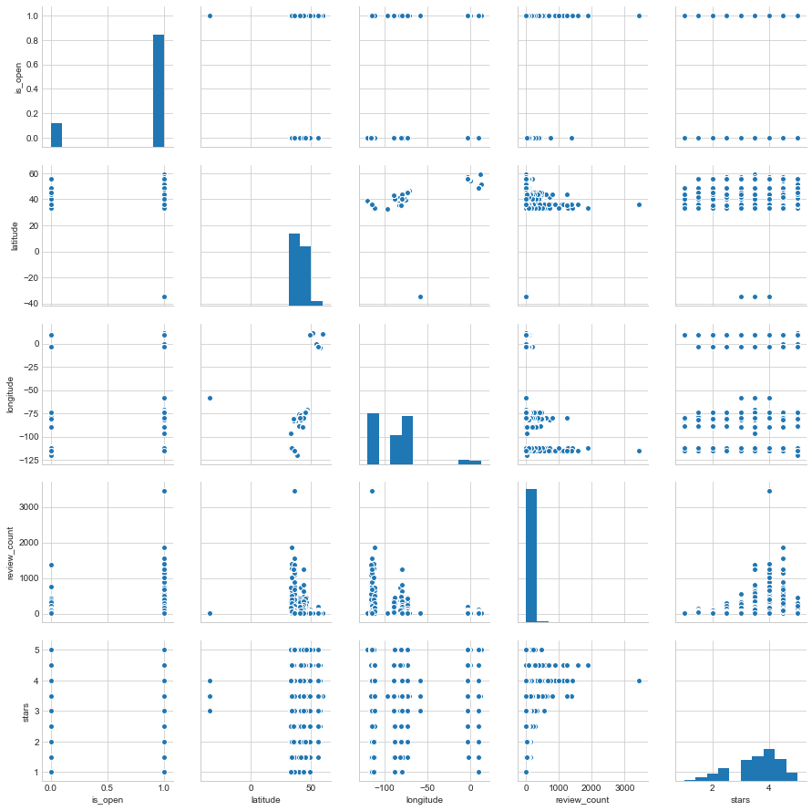


```python
fig, ax = plt.subplots(nrows=1, ncols=1, figsize=(15, 5))

sns.distplot(restaurant_df.stars,kde=False,color = 'g',ax =ax,bins=20);
ax.axvline(restaurant_df.stars.mean(), 0, 1, color='r', label='Mean')
ax.legend();
ax.set_ylabel('Count',size=20)
ax.set_xlabel('Stars',size=20)
ax.set_title('Distribution(count) of Restaurant rating',size=20);
```


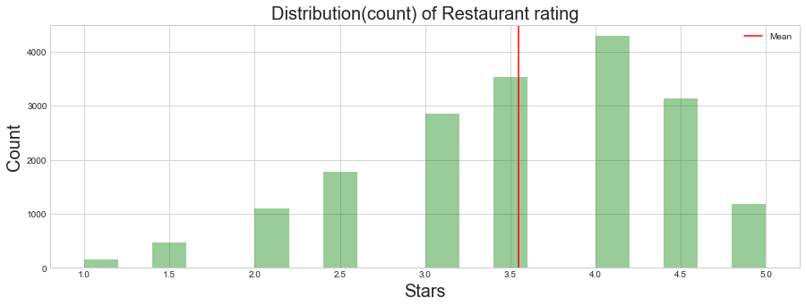


```python
#review just for business which are restautrant
review_df_filter_df = review_df.merge(restaurant_df,how='inner',on='business_id')

fig, ax = plt.subplots(nrows=1, ncols=1, figsize=(15, 5))
sns.distplot(review_df_filter_df.stars_x,kde=False,color = 'g',ax =ax,bins=20);
ax.axvline(review_df_filter_df.stars_x.mean(), 0, 1, color='r', label='Mean')
ax.legend();
ax.set_ylabel('Count',size=20)
ax.set_xlabel('Stars',size=20)
ax.set_title('Distribution(count) of different Reviews rating',size=20)
```


    <matplotlib.text.Text at 0x1162862b0>


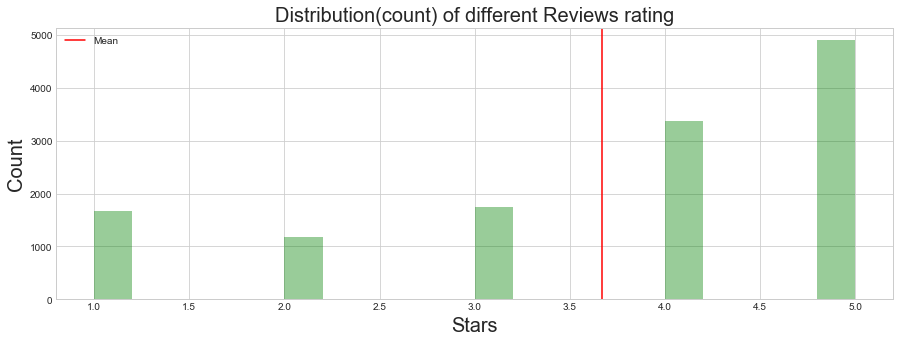


```python
#user just for business which are restautrant
user_df_filter_df = complete_df.groupby(['user_id'],as_index=False).mean()

fig, ax = plt.subplots(nrows=1, ncols=1, figsize=(15, 5))
sns.distplot(user_df_filter_df.average_stars,kde=False,color = 'g',ax =ax,bins=20);
ax.axvline(user_df_filter_df.average_stars.mean(), 0, 1, color='r', label='Mean')
ax.legend();
ax.set_ylabel('Count',size=20)
ax.set_xlabel('Stars',size=20)
ax.set_title('Distribution(count) of User given rating',size=20)

#fig.tight_layout()
```


    <matplotlib.text.Text at 0x116561ac8>


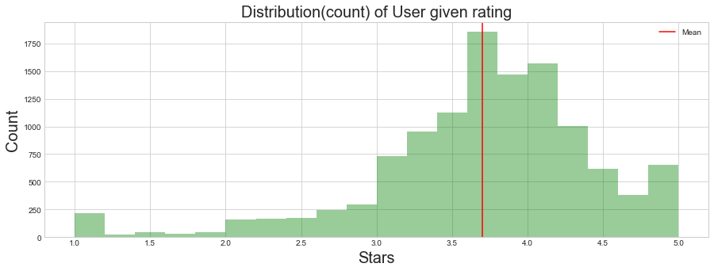


```python
sns.pairplot(review_df_filter_df.iloc[0:10000,:]);

```


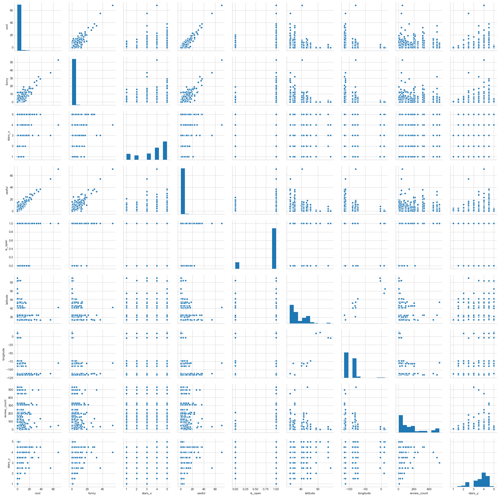


```python
#sns.pairplot(user_df_filter_df.iloc[0:1000,:]);
```


```python
#get top 20 most reviewed restaurants
n_top =20
most_reviewed_restaurant = restaurant_df.nlargest(n_top, 'review_count')
fig, ax = plt.subplots()
ax = sns.barplot(y="name", x="review_count", data=most_reviewed_restaurant)
ax.set_xlabel('Review Count',size=20)
fig.set_size_inches(12, 8)
plt.title("Most Reviewed Restaurant",fontsize=24);
ax.grid(axis = 'x', color ='green', linestyle='-')
ax.tick_params(axis='both', which='both',length=0)
sns.despine(left=True, bottom=True)

```


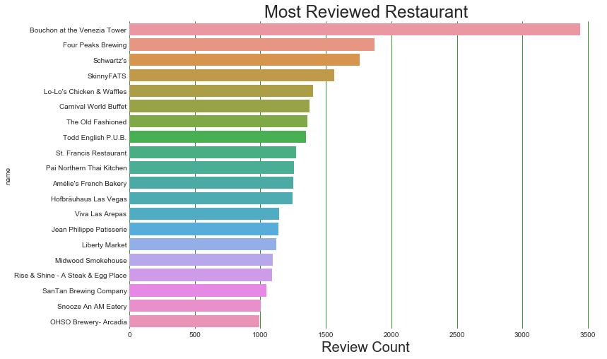


```python
top_rated_restaurant = restaurant_df.sort_values(by=['stars','review_count'],
                                                 ascending=False)[['name','business_id','review_count','stars']]
#get top 10 5 star rated restaurant
n_top =10
top_rated_restaurant = top_rated_restaurant.nlargest(n_top, 'stars')
fig, ax = plt.subplots()
ax = sns.barplot(y="name", x="review_count", data=top_rated_restaurant)
ax.set_xlabel('Count',size=20)
fig.set_size_inches(12, 8)
plt.title("Top 10 5 star rated Restaurant",fontsize=24);
ax.grid(axis = 'x', color ='green', linestyle='-')
ax.tick_params(axis='both', which='both',length=0)
sns.despine(left=True, bottom=True)
```


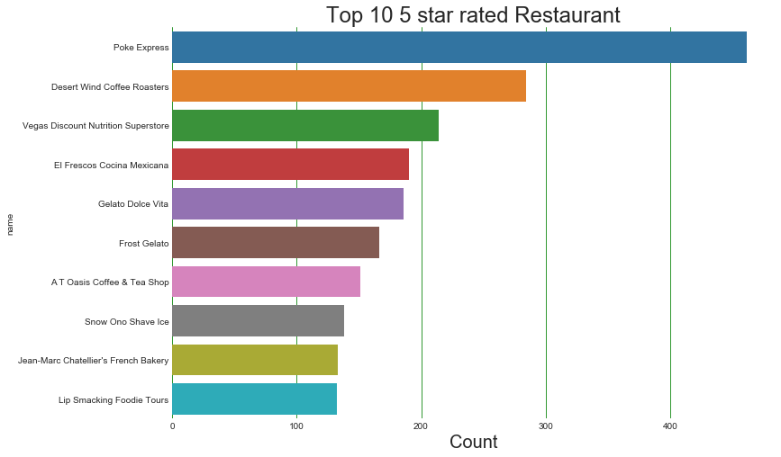


```python
top_rated_restaurant = restaurant_df.sort_values(by=['stars','review_count'],
                                                 ascending=False)[['name','business_id','review_count','stars']]
#top_rated_restaurant
```


```python
def get_food_type_count(category):
    count = restaurant_df[restaurant_df['categories'].str.contains(category)==True]['business_id'].count()
    return count

```


```python
food_dict = {}
food_categories = ['American','Italian','Mexican','Chinese','Thai','Indian','Japan','French']
for food_category in food_categories:
    food_dict[food_category] = get_food_type_count(food_category)
    

```


```python
plt.figure(figsize=(20,10))
plt.bar(range(len(food_dict)), food_dict.values(), align='center',color='forestgreen')
plt.xticks(range(len(food_dict)), list(food_dict.keys()),fontsize = 15);
plt.title('Distribution of review count with respect to Food Categories',fontsize=18)
plt.xlabel('Food Category',fontsize=18)
plt.ylabel('Count',fontsize=18)

```


    <matplotlib.text.Text at 0x114639cc0>


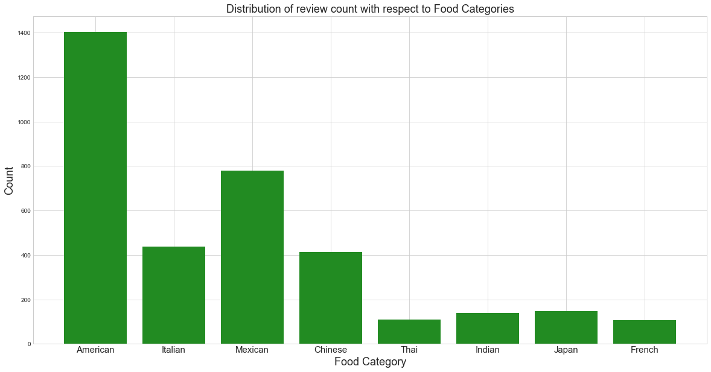


```python
American_restaurant_rating_df = restaurant_df[restaurant_df['categories'].str.contains('American')==True][['business_id','stars','categories','name','review_count']]
Mexican_restaurant_rating_df = restaurant_df[restaurant_df['categories'].str.contains('Mexican')==True][['business_id','stars','categories','name','review_count']]
Chinese_restaurant_rating_df = restaurant_df[restaurant_df['categories'].str.contains('Chinese')==True][['business_id','stars','categories','name','review_count']]
Italian_restaurant_rating_df = restaurant_df[restaurant_df['categories'].str.contains('Italian')==True][['business_id','stars','categories','name','review_count']]

fig, ax = plt.subplots(nrows=2, ncols=2, figsize=(15, 8))
ax = ax.ravel()

def restaurant_category(df, title, ax):

    sns.distplot(df.stars,kde=False,color = 'g',ax =ax,bins=20);
    ax.axvline(df.stars.mean(), 0, 1, color='r', label='Mean')
    ax.legend();
    ax.set_ylabel('Count',size=20)
    ax.set_xlabel('Stars',size=20)
    ax.set_title('Distribution(count) of '+ title + ' Restaurant rating',size=20);

restaurant_category(American_restaurant_rating_df, 'American', ax[0])
restaurant_category(Mexican_restaurant_rating_df, 'Mexican', ax[1])
restaurant_category(Chinese_restaurant_rating_df, 'Chinese', ax[2])
restaurant_category(Italian_restaurant_rating_df, 'Italian', ax[3])

plt.tight_layout()
```


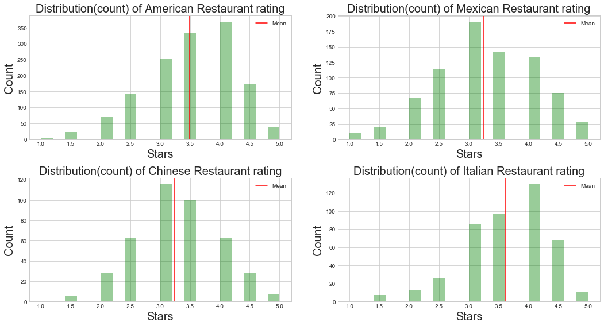


```python
American_restaurant_rating_df.head()
```


<div>
<style>
    .dataframe thead tr:only-child th {
        text-align: right;
    }
    
    .dataframe thead th {
        text-align: left;
    }
    
    .dataframe tbody tr th {
        vertical-align: top;
    }
</style>
<table border="1" class="dataframe">
  <thead>
    <tr style="text-align: right;">
      <th></th>
      <th>business_id</th>
      <th>stars</th>
      <th>categories</th>
      <th>name</th>
      <th>review_count</th>
    </tr>
  </thead>
  <tbody>
    <tr>
      <th>34</th>
      <td>reWc1g65PNZnKz_Ub9QKOQ</td>
      <td>2.5</td>
      <td>['Comfort Food', 'Canadian (New)', 'Restaurant...</td>
      <td>Milestones Restaurants</td>
      <td>51</td>
    </tr>
    <tr>
      <th>55</th>
      <td>Z1r6b30Tg0n0ME4-Zj2wQQ</td>
      <td>3.0</td>
      <td>['American (Traditional)', 'Restaurants', 'Bar...</td>
      <td>Boardwalk Place</td>
      <td>13</td>
    </tr>
    <tr>
      <th>58</th>
      <td>LDMCrFlGIFUN6L-FEFgzWg</td>
      <td>3.0</td>
      <td>['Restaurants', 'American (Traditional)', 'Mex...</td>
      <td>El Pollo Loco</td>
      <td>12</td>
    </tr>
    <tr>
      <th>70</th>
      <td>01xXe2m_z048W5gcBFpoJA</td>
      <td>3.5</td>
      <td>['American (New)', 'Burgers', 'Fast Food', 'Re...</td>
      <td>Five Guys</td>
      <td>63</td>
    </tr>
    <tr>
      <th>82</th>
      <td>fl2TPNWrchkCbNEg0utjvw</td>
      <td>2.0</td>
      <td>['Diners', 'Breakfast &amp; Brunch', 'Burgers', 'A...</td>
      <td>Steak 'n Shake</td>
      <td>14</td>
    </tr>
  </tbody>
</table>
</div>


```python
American_top_rated_restaurant = American_restaurant_rating_df.sort_values(by=['stars','review_count'],
                                                 ascending=False)[['name','business_id','review_count','stars']]
#get top 20 5 star rated restaurant
n_top =20
American_top_rated_restaurant = American_top_rated_restaurant.nlargest(n_top, 'stars')
fig, ax = plt.subplots()
ax = sns.barplot(y="name", x="review_count", data=American_top_rated_restaurant)
ax.set_xlabel('Count',size=20)
fig.set_size_inches(12, 8)
plt.title("Top 20 American 5 star rated Restaurant",fontsize=24);
ax.grid(axis = 'x', color ='green', linestyle='-')
ax.tick_params(axis='both', which='both',length=0)
sns.despine(left=True, bottom=True)
```


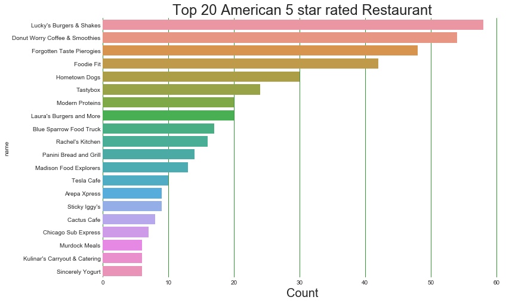


```python

#get top 10 most reviewing users
n_top =10
most_review_user = user_df_filter_df.nlargest(n_top, 'review_count_y').reindex()
fig, ax = plt.subplots()
ax = sns.barplot(y="user_id", x="review_count_y", data=most_review_user)
ax.set_xlabel('Review Count',size=20)
fig.set_size_inches(12, 8)
plt.title("High count Top 10 users who reviewed Restaurant ",fontsize=24);
ax.grid(axis = 'x', color ='green', linestyle='-')
ax.tick_params(axis='both', which='both',length=0)
sns.despine(left=True, bottom=True)

```


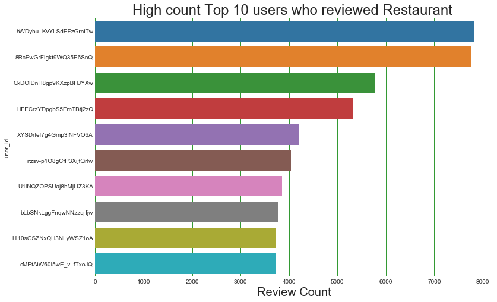


```python
fig, ax = plt.subplots(nrows=1, ncols=2, figsize=(15, 8))
user_df_filter_df.review_count_y.hist(bins=400,ax=ax[0],color='red')
#plt.xlim([0,1000])
ax[0].legend();
ax[0].set_xlim([0,1000])
ax[0].set_ylabel('Review Count',size=20)
ax[0].set_xlabel('Num of Users',size=20)
ax[0].set_title('Distribution of Review Count given by User', size=20);
restaurant_df.review_count.hist(bins=400,ax=ax[1])
ax[1].set_xlim([0,300])
ax[1].legend();
ax[1].set_ylabel('Review Count',size=20)
ax[1].set_xlabel('Num of Restaurant',size=20)
ax[1].set_title('Distribution of Review Count given to Restaurant',size=20);

```


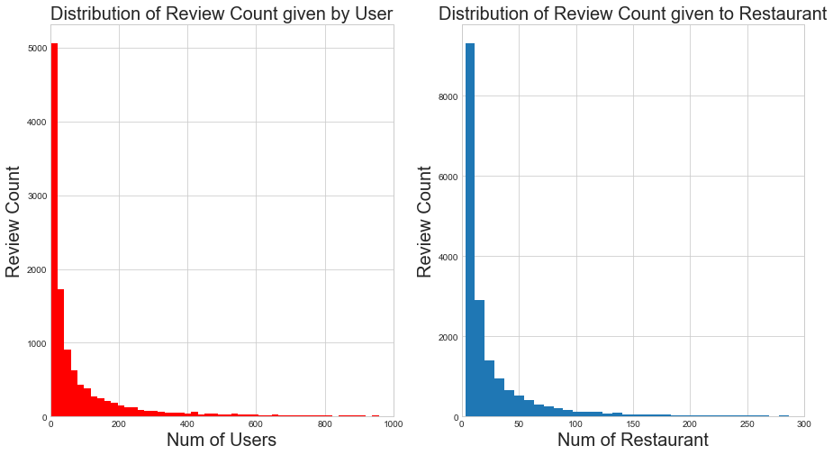


```python
user_df_filter_df['user_id'].nunique()
```


    11749


### Creating Baseline


```python
complete_df.head(2)
```


<div>
<style>
    .dataframe thead tr:only-child th {
        text-align: right;
    }
    
    .dataframe thead th {
        text-align: left;
    }
    
    .dataframe tbody tr th {
        vertical-align: top;
    }
</style>
<table border="1" class="dataframe">
  <thead>
    <tr style="text-align: right;">
      <th></th>
      <th>address</th>
      <th>attributes</th>
      <th>business_id</th>
      <th>categories</th>
      <th>city</th>
      <th>hours</th>
      <th>is_open</th>
      <th>latitude</th>
      <th>longitude</th>
      <th>name_x</th>
      <th>neighborhood</th>
      <th>postal_code</th>
      <th>review_count_x</th>
      <th>stars_x</th>
      <th>state</th>
      <th>cool_x</th>
      <th>date</th>
      <th>funny_x</th>
      <th>review_id</th>
      <th>stars_y</th>
      <th>text</th>
      <th>useful_x</th>
      <th>user_id</th>
      <th>average_stars</th>
      <th>compliment_cool</th>
      <th>compliment_cute</th>
      <th>compliment_funny</th>
      <th>compliment_hot</th>
      <th>compliment_list</th>
      <th>compliment_more</th>
      <th>compliment_note</th>
      <th>compliment_photos</th>
      <th>compliment_plain</th>
      <th>compliment_profile</th>
      <th>compliment_writer</th>
      <th>cool_y</th>
      <th>elite</th>
      <th>fans</th>
      <th>friends</th>
      <th>funny_y</th>
      <th>name_y</th>
      <th>review_count_y</th>
      <th>useful_y</th>
      <th>yelping_since</th>
    </tr>
  </thead>
  <tbody>
    <tr>
      <th>0</th>
      <td>1203 E Charleston Blvd, Ste 140</td>
      <td>{'RestaurantsTableService': True, 'GoodForMeal...</td>
      <td>YTqtM2WFhcMZGeAGA08Cfg</td>
      <td>['Seafood', 'Restaurants', 'Specialty Food', '...</td>
      <td>Las Vegas</td>
      <td>{'Monday': '10:30-21:00', 'Tuesday': '10:30-21...</td>
      <td>1</td>
      <td>36.159363</td>
      <td>-115.135949</td>
      <td>Mariscos Playa Escondida</td>
      <td>Downtown</td>
      <td>89104</td>
      <td>330</td>
      <td>4.5</td>
      <td>NV</td>
      <td>0</td>
      <td>2016-09-16</td>
      <td>1</td>
      <td>ZH8g_PoY0Tr3YdQ-RGySrA</td>
      <td>5</td>
      <td>Great place. There was a man here who was very...</td>
      <td>1</td>
      <td>EDe16577dBImA1ypOzPlKg</td>
      <td>5.00</td>
      <td>0</td>
      <td>0</td>
      <td>0</td>
      <td>0</td>
      <td>0</td>
      <td>0</td>
      <td>0</td>
      <td>0</td>
      <td>0</td>
      <td>0</td>
      <td>0</td>
      <td>0</td>
      <td>[]</td>
      <td>0</td>
      <td>[]</td>
      <td>0</td>
      <td>Jessica</td>
      <td>1</td>
      <td>0</td>
      <td>2014-07-26</td>
    </tr>
    <tr>
      <th>1</th>
      <td>1203 E Charleston Blvd, Ste 140</td>
      <td>{'RestaurantsTableService': True, 'GoodForMeal...</td>
      <td>YTqtM2WFhcMZGeAGA08Cfg</td>
      <td>['Seafood', 'Restaurants', 'Specialty Food', '...</td>
      <td>Las Vegas</td>
      <td>{'Monday': '10:30-21:00', 'Tuesday': '10:30-21...</td>
      <td>1</td>
      <td>36.159363</td>
      <td>-115.135949</td>
      <td>Mariscos Playa Escondida</td>
      <td>Downtown</td>
      <td>89104</td>
      <td>330</td>
      <td>4.5</td>
      <td>NV</td>
      <td>1</td>
      <td>2014-11-13</td>
      <td>1</td>
      <td>6r2uAJE1dqUq1IHn_3R3qA</td>
      <td>4</td>
      <td>HOT HOT HOT! Real Mexican Food\n\nNO fake wate...</td>
      <td>2</td>
      <td>twx2ZgFUbat87vGQ_tFbPA</td>
      <td>3.55</td>
      <td>0</td>
      <td>0</td>
      <td>0</td>
      <td>2</td>
      <td>0</td>
      <td>1</td>
      <td>3</td>
      <td>0</td>
      <td>5</td>
      <td>0</td>
      <td>0</td>
      <td>11</td>
      <td>[]</td>
      <td>3</td>
      <td>[eFObFWgDiQJwUiy9WlhOfg, W4KL3Q_AVGfRrWcwR60gK...</td>
      <td>29</td>
      <td>Edwin</td>
      <td>94</td>
      <td>317</td>
      <td>2010-12-30</td>
    </tr>
  </tbody>
</table>
</div>


```python
baseline_df = complete_df[['user_id','business_id','stars_y']]
```


```python
from surprise import SVD,BaselineOnly, Reader
from surprise import Dataset
from surprise import Reader

from surprise import evaluate, print_perf


#surprise.dataset.Reader(name=None, line_format=u'user item rating', sep=None, rating_scale=(1, 5), skip_lines=0)

reader = Reader(rating_scale=(1, 5))
data = Dataset.load_from_df(baseline_df,reader)
data.split(n_folds=3)

algo = BaselineOnly()

perf = evaluate(algo, data, measures=['RMSE', 'MAE'])

print_perf(perf)
```

    Evaluating RMSE, MAE of algorithm BaselineOnly.

    ------------
    Fold 1
    Estimating biases using als...
    RMSE: 1.2676
    MAE:  1.0280
    ------------
    Fold 2
    Estimating biases using als...
    RMSE: 1.2226
    MAE:  1.0001
    ------------
    Fold 3
    Estimating biases using als...
    RMSE: 1.2540
    MAE:  1.0147
    ------------
    ------------
    Mean RMSE: 1.2481
    Mean MAE : 1.0143
    ------------
    ------------
            Fold 1  Fold 2  Fold 3  Mean    
    RMSE    1.2676  1.2226  1.2540  1.2481  
    MAE     1.0280  1.0001  1.0147  1.0143  


```python
from surprise import SVD,BaselineOnly,KNNBaseline
from surprise import Dataset
from surprise import Reader

from surprise import evaluate, print_perf


#surprise.dataset.Reader(name=None, line_format=u'user item rating', sep=None, rating_scale=(1, 5), skip_lines=0)

reader = Reader(rating_scale=(1, 5))
data = Dataset.load_from_df(baseline_df,reader)
data.split(n_folds=3)

algo = KNNBaseline()

perf = evaluate(algo, data, measures=['RMSE', 'MAE'])

print_perf(perf)
```

    Evaluating RMSE, MAE of algorithm KNNBaseline.

    ------------
    Fold 1
    Estimating biases using als...
    Computing the msd similarity matrix...
    Done computing similarity matrix.
    RMSE: 1.2722
    MAE:  1.0310
    ------------
    Fold 2
    Estimating biases using als...
    Computing the msd similarity matrix...
    Done computing similarity matrix.
    RMSE: 1.2529
    MAE:  1.0216
    ------------
    Fold 3
    Estimating biases using als...
    Computing the msd similarity matrix...
    Done computing similarity matrix.
    RMSE: 1.2436
    MAE:  1.0091
    ------------
    ------------
    Mean RMSE: 1.2562
    Mean MAE : 1.0206
    ------------
    ------------
            Fold 1  Fold 2  Fold 3  Mean    
    RMSE    1.2722  1.2529  1.2436  1.2562  
    MAE     1.0310  1.0216  1.0091  1.0206  


```python
complete_df.head()
```


<div>
<style>
    .dataframe thead tr:only-child th {
        text-align: right;
    }
    
    .dataframe thead th {
        text-align: left;
    }
    
    .dataframe tbody tr th {
        vertical-align: top;
    }
</style>
<table border="1" class="dataframe">
  <thead>
    <tr style="text-align: right;">
      <th></th>
      <th>address</th>
      <th>attributes</th>
      <th>business_id</th>
      <th>categories</th>
      <th>city</th>
      <th>hours</th>
      <th>is_open</th>
      <th>latitude</th>
      <th>longitude</th>
      <th>name_x</th>
      <th>neighborhood</th>
      <th>postal_code</th>
      <th>review_count_x</th>
      <th>stars_x</th>
      <th>state</th>
      <th>cool_x</th>
      <th>date</th>
      <th>funny_x</th>
      <th>review_id</th>
      <th>stars_y</th>
      <th>text</th>
      <th>useful_x</th>
      <th>user_id</th>
      <th>average_stars</th>
      <th>compliment_cool</th>
      <th>compliment_cute</th>
      <th>compliment_funny</th>
      <th>compliment_hot</th>
      <th>compliment_list</th>
      <th>compliment_more</th>
      <th>compliment_note</th>
      <th>compliment_photos</th>
      <th>compliment_plain</th>
      <th>compliment_profile</th>
      <th>compliment_writer</th>
      <th>cool_y</th>
      <th>elite</th>
      <th>fans</th>
      <th>friends</th>
      <th>funny_y</th>
      <th>name_y</th>
      <th>review_count_y</th>
      <th>useful_y</th>
      <th>yelping_since</th>
    </tr>
  </thead>
  <tbody>
    <tr>
      <th>0</th>
      <td>1203 E Charleston Blvd, Ste 140</td>
      <td>{'RestaurantsTableService': True, 'GoodForMeal...</td>
      <td>YTqtM2WFhcMZGeAGA08Cfg</td>
      <td>['Seafood', 'Restaurants', 'Specialty Food', '...</td>
      <td>Las Vegas</td>
      <td>{'Monday': '10:30-21:00', 'Tuesday': '10:30-21...</td>
      <td>1</td>
      <td>36.159363</td>
      <td>-115.135949</td>
      <td>Mariscos Playa Escondida</td>
      <td>Downtown</td>
      <td>89104</td>
      <td>330</td>
      <td>4.5</td>
      <td>NV</td>
      <td>0</td>
      <td>2016-09-16</td>
      <td>1</td>
      <td>ZH8g_PoY0Tr3YdQ-RGySrA</td>
      <td>5</td>
      <td>Great place. There was a man here who was very...</td>
      <td>1</td>
      <td>EDe16577dBImA1ypOzPlKg</td>
      <td>5.00</td>
      <td>0</td>
      <td>0</td>
      <td>0</td>
      <td>0</td>
      <td>0</td>
      <td>0</td>
      <td>0</td>
      <td>0</td>
      <td>0</td>
      <td>0</td>
      <td>0</td>
      <td>0</td>
      <td>[]</td>
      <td>0</td>
      <td>[]</td>
      <td>0</td>
      <td>Jessica</td>
      <td>1</td>
      <td>0</td>
      <td>2014-07-26</td>
    </tr>
    <tr>
      <th>1</th>
      <td>1203 E Charleston Blvd, Ste 140</td>
      <td>{'RestaurantsTableService': True, 'GoodForMeal...</td>
      <td>YTqtM2WFhcMZGeAGA08Cfg</td>
      <td>['Seafood', 'Restaurants', 'Specialty Food', '...</td>
      <td>Las Vegas</td>
      <td>{'Monday': '10:30-21:00', 'Tuesday': '10:30-21...</td>
      <td>1</td>
      <td>36.159363</td>
      <td>-115.135949</td>
      <td>Mariscos Playa Escondida</td>
      <td>Downtown</td>
      <td>89104</td>
      <td>330</td>
      <td>4.5</td>
      <td>NV</td>
      <td>1</td>
      <td>2014-11-13</td>
      <td>1</td>
      <td>6r2uAJE1dqUq1IHn_3R3qA</td>
      <td>4</td>
      <td>HOT HOT HOT! Real Mexican Food\n\nNO fake wate...</td>
      <td>2</td>
      <td>twx2ZgFUbat87vGQ_tFbPA</td>
      <td>3.55</td>
      <td>0</td>
      <td>0</td>
      <td>0</td>
      <td>2</td>
      <td>0</td>
      <td>1</td>
      <td>3</td>
      <td>0</td>
      <td>5</td>
      <td>0</td>
      <td>0</td>
      <td>11</td>
      <td>[]</td>
      <td>3</td>
      <td>[eFObFWgDiQJwUiy9WlhOfg, W4KL3Q_AVGfRrWcwR60gK...</td>
      <td>29</td>
      <td>Edwin</td>
      <td>94</td>
      <td>317</td>
      <td>2010-12-30</td>
    </tr>
    <tr>
      <th>2</th>
      <td>1203 E Charleston Blvd, Ste 140</td>
      <td>{'RestaurantsTableService': True, 'GoodForMeal...</td>
      <td>YTqtM2WFhcMZGeAGA08Cfg</td>
      <td>['Seafood', 'Restaurants', 'Specialty Food', '...</td>
      <td>Las Vegas</td>
      <td>{'Monday': '10:30-21:00', 'Tuesday': '10:30-21...</td>
      <td>1</td>
      <td>36.159363</td>
      <td>-115.135949</td>
      <td>Mariscos Playa Escondida</td>
      <td>Downtown</td>
      <td>89104</td>
      <td>330</td>
      <td>4.5</td>
      <td>NV</td>
      <td>0</td>
      <td>2016-07-13</td>
      <td>0</td>
      <td>Xk5C3Uow4X4I20csEKkdPQ</td>
      <td>5</td>
      <td>Cozy typical Mexican joint you'd see anywhere,...</td>
      <td>0</td>
      <td>6zaNNSYJUdLGqiz4xox0KQ</td>
      <td>4.50</td>
      <td>1</td>
      <td>0</td>
      <td>1</td>
      <td>0</td>
      <td>0</td>
      <td>0</td>
      <td>0</td>
      <td>0</td>
      <td>0</td>
      <td>0</td>
      <td>0</td>
      <td>0</td>
      <td>[]</td>
      <td>0</td>
      <td>[SePcAef2Dp3enlcLQ6_2Jw, T8FJ1se-3wjsOrE506mLJ...</td>
      <td>0</td>
      <td>José</td>
      <td>13</td>
      <td>0</td>
      <td>2016-07-10</td>
    </tr>
    <tr>
      <th>3</th>
      <td>1203 E Charleston Blvd, Ste 140</td>
      <td>{'RestaurantsTableService': True, 'GoodForMeal...</td>
      <td>YTqtM2WFhcMZGeAGA08Cfg</td>
      <td>['Seafood', 'Restaurants', 'Specialty Food', '...</td>
      <td>Las Vegas</td>
      <td>{'Monday': '10:30-21:00', 'Tuesday': '10:30-21...</td>
      <td>1</td>
      <td>36.159363</td>
      <td>-115.135949</td>
      <td>Mariscos Playa Escondida</td>
      <td>Downtown</td>
      <td>89104</td>
      <td>330</td>
      <td>4.5</td>
      <td>NV</td>
      <td>0</td>
      <td>2014-12-05</td>
      <td>0</td>
      <td>S0eYx0yiWMOh6-J-Znv6Ag</td>
      <td>5</td>
      <td>Excellent restaurant!  I had the empenadas,  f...</td>
      <td>0</td>
      <td>9rAqVK2XhLaHEEPXBuVT_A</td>
      <td>3.72</td>
      <td>0</td>
      <td>0</td>
      <td>0</td>
      <td>0</td>
      <td>0</td>
      <td>0</td>
      <td>2</td>
      <td>0</td>
      <td>0</td>
      <td>0</td>
      <td>0</td>
      <td>0</td>
      <td>[]</td>
      <td>0</td>
      <td>[]</td>
      <td>0</td>
      <td>David</td>
      <td>89</td>
      <td>2</td>
      <td>2012-06-04</td>
    </tr>
    <tr>
      <th>4</th>
      <td>1203 E Charleston Blvd, Ste 140</td>
      <td>{'RestaurantsTableService': True, 'GoodForMeal...</td>
      <td>YTqtM2WFhcMZGeAGA08Cfg</td>
      <td>['Seafood', 'Restaurants', 'Specialty Food', '...</td>
      <td>Las Vegas</td>
      <td>{'Monday': '10:30-21:00', 'Tuesday': '10:30-21...</td>
      <td>1</td>
      <td>36.159363</td>
      <td>-115.135949</td>
      <td>Mariscos Playa Escondida</td>
      <td>Downtown</td>
      <td>89104</td>
      <td>330</td>
      <td>4.5</td>
      <td>NV</td>
      <td>0</td>
      <td>2014-11-25</td>
      <td>0</td>
      <td>SKq7AM8_xYYSbIrXxD917A</td>
      <td>5</td>
      <td>What a find!! About 4 miles of the Strip in a ...</td>
      <td>0</td>
      <td>fAVYvzTBpjEAUTxKfGPRbg</td>
      <td>3.46</td>
      <td>0</td>
      <td>0</td>
      <td>0</td>
      <td>0</td>
      <td>0</td>
      <td>0</td>
      <td>0</td>
      <td>0</td>
      <td>0</td>
      <td>0</td>
      <td>0</td>
      <td>2</td>
      <td>[]</td>
      <td>1</td>
      <td>[Fcb_M7Mhv7e6a89LF3F-bA, W8Dg5WYXsAPTXcAXcpbGF...</td>
      <td>2</td>
      <td>Lisa</td>
      <td>24</td>
      <td>22</td>
      <td>2013-09-16</td>
    </tr>
  </tbody>
</table>
</div>


```python
moviemat = complete_df.pivot_table(index='user_id',columns='business_id',values='stars_y')

```


```python
moviemat.shape
```


    (11749, 482)


```python
moviemat[moviemat['-3EqqxYhmi3G0QG1-zPyCg'].notnull()]
```


<div>
<style>
    .dataframe thead tr:only-child th {
        text-align: right;
    }
    
    .dataframe thead th {
        text-align: left;
    }
    
    .dataframe tbody tr th {
        vertical-align: top;
    }
</style>
<table border="1" class="dataframe">
  <thead>
    <tr style="text-align: right;">
      <th>business_id</th>
      <th>-3EqqxYhmi3G0QG1-zPyCg</th>
      <th>-7HB0UjguXW8csOH9svG4Q</th>
      <th>-L7mpRnghi0ZlSsO5wExZA</th>
      <th>-NGG-U19rGsY75a2ogSD_w</th>
      <th>-RxkfrFaOLpE6Be3zGfsVg</th>
      <th>-cYOKJ5kbVZqzSYQIzZcqA</th>
      <th>-gTX7XKGOntF2FQ1EDxHpA</th>
      <th>-kTHAUKuzh7cFZjVAW55Ug</th>
      <th>-llrUA_TlQTWH_CMM3NTNQ</th>
      <th>-vDDh94UcgxSNjMzi4UDBA</th>
      <th>-wXyBph4d0IQlQrS8H1rDw</th>
      <th>07HZ70wpawSANXKK4CkqpQ</th>
      <th>0G-WFdOu3_KW3mBZJQq5Cg</th>
      <th>0PlZmy62LZmy5mA2BE6znw</th>
      <th>0Tutx9JhCi_HE6MUnbh5vw</th>
      <th>0XoTT540HMB_5q4Exj8yGA</th>
      <th>0_Yc6blfiI9A6Q8bKjYLSQ</th>
      <th>0dbEthYMUMCk9WzVGGZ9zg</th>
      <th>0drLgbfPxNN0ODVwzVc_ZA</th>
      <th>0i95sgY7pzYW9k88SOVJ8A</th>
      <th>0u2xwNy07-z3gv0tpuJX2Q</th>
      <th>0uRtJUdZZw9XjHjgqLG3bQ</th>
      <th>0xAr6kVDval-z2fT-_wP8w</th>
      <th>1D0iBf2EWavOYbVW_-0qnQ</th>
      <th>1FH0-rrgqziDLAw0pZD3QQ</th>
      <th>1IX1ME591Q0LzbJhXDA9EQ</th>
      <th>1M_EjuTA1qM7lNDchPjLpQ</th>
      <th>1nhf9BPXOBFBkbRkpsFaxA</th>
      <th>1qxpl7TaER9i1dxpnLyl2g</th>
      <th>1vGvcWG_XCUgNQVqNSDbrA</th>
      <th>1wEexq5NrFK_YQgl6GG6ng</th>
      <th>2XUYdiTgCsDE0k61QC422A</th>
      <th>2dTjaNEpiVeBAt6JLBQsOw</th>
      <th>2mjwx7w6IN_BoHG5iy8IGg</th>
      <th>3F_vOiZqBvpDCjXpKsMJ_w</th>
      <th>3HfRVRP7dWzOzrfbZmzk-Q</th>
      <th>3VJ8qR-ulhPD1DMTPQD6QA</th>
      <th>3c9YWzy7ZkAAiaj4v1AGmA</th>
      <th>3cNqw2lrsMPaVAykdSbzTQ</th>
      <th>3dnF0DnQX0PqRb8wDyMJkA</th>
      <th>3gb8uCbxO8XXGHitcQ1Z9A</th>
      <th>3vlAG8FVYRB9wEIZXFk3ag</th>
      <th>4-xLjGavuWFqEfNuznxL3A</th>
      <th>45F5VaVlvrrtFikPa2v-tQ</th>
      <th>4M07K6U7e37w7gZZpIgu1g</th>
      <th>4Xw-4qC0zY7HI8ZlxNL49g</th>
      <th>4eVERS3EyPLMSmZrz_ZRng</th>
      <th>4hWDMVtfnpyY72_5QMbthA</th>
      <th>4kSNvEXofkPpDsuA9_T1Yg</th>
      <th>4pxK5njPxYHFp7IMEch1Bw</th>
      <th>...</th>
      <th>slaDHdZ6T09hPnpmp0SLIg</th>
      <th>spQpzWHvYGnindM9_Om3Yw</th>
      <th>sqFU1WIFbH_rrJJVHR4Z0g</th>
      <th>su78hWad2k7vNIl_ISEXiA</th>
      <th>svT1TdTgTd4k4-utMCQU8w</th>
      <th>t3SJmq6BAtypKlokPiY0yA</th>
      <th>tIfrw4mWxHHG2TGScdk7Jg</th>
      <th>tXusw4j0l9IGJj3fmUKUpg</th>
      <th>ta8x5JgBJnKaDWfYvpEYnw</th>
      <th>tulUhFYMvBkYHsjmn30A9w</th>
      <th>uQBAiqEx6yYjidHSUoUMUw</th>
      <th>uY8u-Js0SzoLbL-JKJdMLw</th>
      <th>urgjbqhtZD20G5h3XM76wQ</th>
      <th>uxDnXOh6hAWKw1Q31XHnww</th>
      <th>uzId1JeXo206QIhJIpqV1w</th>
      <th>v-z5Tw5ds2sEvtk3Kj5x4w</th>
      <th>v3J8lYqWOnJY_e6zc56W7Q</th>
      <th>vCRgJTNdWcKuN8rxjvo8Xw</th>
      <th>vOQ37XBxWePPfS5HJ7SoHw</th>
      <th>v_yBcIBwKJXtLozZgBaoEw</th>
      <th>vpsc8vfnkaEd7-49_lz9Zg</th>
      <th>vs3iBaJ_vZRlcbfthkgsKw</th>
      <th>vtR_SWLrMzBKVsf0fCNXwQ</th>
      <th>w0ZJzBv7PVq2B_JHZswwbA</th>
      <th>w6JuMJTyLB7vwDqBvtMiTQ</th>
      <th>wBNmAKFJy3UjvKwNIEbbGQ</th>
      <th>wGwib7KvPzs5_6aPCk_Fzw</th>
      <th>wRnHhHISzEjB3jxwGtTpXg</th>
      <th>wShT0KXCW0ZAnNKdJr_1pg</th>
      <th>wTkvfI1YGelq7NUYO0tl1Q</th>
      <th>wjHw2vCIfu17exRWpFwk4g</th>
      <th>x6IffPPcCWOnVA40_joQVA</th>
      <th>x8eZMhRs3tSGzdwpPB4QdQ</th>
      <th>xBgQ4T6mhS5VsmK9u6mBcg</th>
      <th>xBkivY-RacJHXX6y0-91GA</th>
      <th>xRrHTt8LcWsGgZ7yQ6YSYQ</th>
      <th>xXva4FPrp-HUSYp0Stwe1g</th>
      <th>xn9xI9z_xcQBHWtuS_IGbA</th>
      <th>xzQzJTu47vNCYlpB8jdMaw</th>
      <th>y6Daer5X-Uv11AZL0SuyHg</th>
      <th>yALlUmXryvR3oNsE3cJEBw</th>
      <th>yJR6hSqkeArLl50mLS7kDg</th>
      <th>yRk8ezAFV59HDHsuHiiU6Q</th>
      <th>yc1IZG2BL4WCYBHk5noj5g</th>
      <th>yo1G0hD855DYmU-YVlIKcw</th>
      <th>zK2JKTd97aSrgXSPY4ysmA</th>
      <th>zYPc6o81Em23wRW8oq7_3w</th>
      <th>ziLL460qJXfDLYaO3yc9cg</th>
      <th>zuCu5ff06l4Pe33qYe58MA</th>
      <th>zvsJSNdg9UXEIL6FKiGa3Q</th>
    </tr>
    <tr>
      <th>user_id</th>
      <th></th>
      <th></th>
      <th></th>
      <th></th>
      <th></th>
      <th></th>
      <th></th>
      <th></th>
      <th></th>
      <th></th>
      <th></th>
      <th></th>
      <th></th>
      <th></th>
      <th></th>
      <th></th>
      <th></th>
      <th></th>
      <th></th>
      <th></th>
      <th></th>
      <th></th>
      <th></th>
      <th></th>
      <th></th>
      <th></th>
      <th></th>
      <th></th>
      <th></th>
      <th></th>
      <th></th>
      <th></th>
      <th></th>
      <th></th>
      <th></th>
      <th></th>
      <th></th>
      <th></th>
      <th></th>
      <th></th>
      <th></th>
      <th></th>
      <th></th>
      <th></th>
      <th></th>
      <th></th>
      <th></th>
      <th></th>
      <th></th>
      <th></th>
      <th></th>
      <th></th>
      <th></th>
      <th></th>
      <th></th>
      <th></th>
      <th></th>
      <th></th>
      <th></th>
      <th></th>
      <th></th>
      <th></th>
      <th></th>
      <th></th>
      <th></th>
      <th></th>
      <th></th>
      <th></th>
      <th></th>
      <th></th>
      <th></th>
      <th></th>
      <th></th>
      <th></th>
      <th></th>
      <th></th>
      <th></th>
      <th></th>
      <th></th>
      <th></th>
      <th></th>
      <th></th>
      <th></th>
      <th></th>
      <th></th>
      <th></th>
      <th></th>
      <th></th>
      <th></th>
      <th></th>
      <th></th>
      <th></th>
      <th></th>
      <th></th>
      <th></th>
      <th></th>
      <th></th>
      <th></th>
      <th></th>
      <th></th>
      <th></th>
    </tr>
  </thead>
  <tbody>
    <tr>
      <th>0ibkznjKzGlySB12WIn82w</th>
      <td>4.0</td>
      <td>NaN</td>
      <td>NaN</td>
      <td>NaN</td>
      <td>NaN</td>
      <td>NaN</td>
      <td>NaN</td>
      <td>NaN</td>
      <td>NaN</td>
      <td>NaN</td>
      <td>NaN</td>
      <td>NaN</td>
      <td>NaN</td>
      <td>NaN</td>
      <td>NaN</td>
      <td>NaN</td>
      <td>NaN</td>
      <td>NaN</td>
      <td>NaN</td>
      <td>NaN</td>
      <td>NaN</td>
      <td>NaN</td>
      <td>NaN</td>
      <td>NaN</td>
      <td>NaN</td>
      <td>NaN</td>
      <td>NaN</td>
      <td>NaN</td>
      <td>NaN</td>
      <td>NaN</td>
      <td>NaN</td>
      <td>NaN</td>
      <td>NaN</td>
      <td>NaN</td>
      <td>NaN</td>
      <td>NaN</td>
      <td>NaN</td>
      <td>NaN</td>
      <td>NaN</td>
      <td>NaN</td>
      <td>NaN</td>
      <td>NaN</td>
      <td>NaN</td>
      <td>NaN</td>
      <td>NaN</td>
      <td>NaN</td>
      <td>NaN</td>
      <td>NaN</td>
      <td>NaN</td>
      <td>NaN</td>
      <td>...</td>
      <td>NaN</td>
      <td>NaN</td>
      <td>NaN</td>
      <td>NaN</td>
      <td>NaN</td>
      <td>NaN</td>
      <td>NaN</td>
      <td>NaN</td>
      <td>NaN</td>
      <td>NaN</td>
      <td>NaN</td>
      <td>NaN</td>
      <td>NaN</td>
      <td>NaN</td>
      <td>NaN</td>
      <td>NaN</td>
      <td>NaN</td>
      <td>NaN</td>
      <td>NaN</td>
      <td>NaN</td>
      <td>NaN</td>
      <td>NaN</td>
      <td>NaN</td>
      <td>NaN</td>
      <td>NaN</td>
      <td>NaN</td>
      <td>NaN</td>
      <td>NaN</td>
      <td>NaN</td>
      <td>NaN</td>
      <td>NaN</td>
      <td>NaN</td>
      <td>NaN</td>
      <td>NaN</td>
      <td>NaN</td>
      <td>NaN</td>
      <td>NaN</td>
      <td>NaN</td>
      <td>NaN</td>
      <td>NaN</td>
      <td>NaN</td>
      <td>NaN</td>
      <td>NaN</td>
      <td>NaN</td>
      <td>NaN</td>
      <td>NaN</td>
      <td>NaN</td>
      <td>NaN</td>
      <td>NaN</td>
      <td>NaN</td>
    </tr>
    <tr>
      <th>9hDOM-Np3kdcn6dm54nqvg</th>
      <td>5.0</td>
      <td>NaN</td>
      <td>NaN</td>
      <td>NaN</td>
      <td>NaN</td>
      <td>NaN</td>
      <td>NaN</td>
      <td>NaN</td>
      <td>NaN</td>
      <td>NaN</td>
      <td>NaN</td>
      <td>NaN</td>
      <td>NaN</td>
      <td>NaN</td>
      <td>NaN</td>
      <td>NaN</td>
      <td>NaN</td>
      <td>NaN</td>
      <td>NaN</td>
      <td>NaN</td>
      <td>NaN</td>
      <td>NaN</td>
      <td>NaN</td>
      <td>NaN</td>
      <td>NaN</td>
      <td>NaN</td>
      <td>NaN</td>
      <td>NaN</td>
      <td>NaN</td>
      <td>NaN</td>
      <td>NaN</td>
      <td>NaN</td>
      <td>NaN</td>
      <td>NaN</td>
      <td>NaN</td>
      <td>NaN</td>
      <td>NaN</td>
      <td>NaN</td>
      <td>NaN</td>
      <td>NaN</td>
      <td>NaN</td>
      <td>NaN</td>
      <td>NaN</td>
      <td>NaN</td>
      <td>NaN</td>
      <td>NaN</td>
      <td>NaN</td>
      <td>NaN</td>
      <td>NaN</td>
      <td>NaN</td>
      <td>...</td>
      <td>NaN</td>
      <td>NaN</td>
      <td>NaN</td>
      <td>NaN</td>
      <td>NaN</td>
      <td>NaN</td>
      <td>NaN</td>
      <td>NaN</td>
      <td>NaN</td>
      <td>NaN</td>
      <td>NaN</td>
      <td>NaN</td>
      <td>NaN</td>
      <td>NaN</td>
      <td>NaN</td>
      <td>NaN</td>
      <td>NaN</td>
      <td>NaN</td>
      <td>NaN</td>
      <td>NaN</td>
      <td>NaN</td>
      <td>NaN</td>
      <td>NaN</td>
      <td>NaN</td>
      <td>NaN</td>
      <td>NaN</td>
      <td>NaN</td>
      <td>NaN</td>
      <td>NaN</td>
      <td>NaN</td>
      <td>NaN</td>
      <td>NaN</td>
      <td>NaN</td>
      <td>NaN</td>
      <td>NaN</td>
      <td>NaN</td>
      <td>NaN</td>
      <td>NaN</td>
      <td>NaN</td>
      <td>NaN</td>
      <td>NaN</td>
      <td>NaN</td>
      <td>NaN</td>
      <td>NaN</td>
      <td>NaN</td>
      <td>NaN</td>
      <td>NaN</td>
      <td>NaN</td>
      <td>NaN</td>
      <td>NaN</td>
    </tr>
    <tr>
      <th>DQ0LV8cwVqPQ_hvemTFPeg</th>
      <td>5.0</td>
      <td>NaN</td>
      <td>NaN</td>
      <td>NaN</td>
      <td>NaN</td>
      <td>NaN</td>
      <td>NaN</td>
      <td>NaN</td>
      <td>NaN</td>
      <td>NaN</td>
      <td>NaN</td>
      <td>NaN</td>
      <td>NaN</td>
      <td>NaN</td>
      <td>NaN</td>
      <td>NaN</td>
      <td>NaN</td>
      <td>NaN</td>
      <td>NaN</td>
      <td>NaN</td>
      <td>NaN</td>
      <td>NaN</td>
      <td>NaN</td>
      <td>NaN</td>
      <td>NaN</td>
      <td>NaN</td>
      <td>NaN</td>
      <td>NaN</td>
      <td>NaN</td>
      <td>NaN</td>
      <td>NaN</td>
      <td>NaN</td>
      <td>NaN</td>
      <td>NaN</td>
      <td>NaN</td>
      <td>NaN</td>
      <td>NaN</td>
      <td>NaN</td>
      <td>NaN</td>
      <td>NaN</td>
      <td>NaN</td>
      <td>NaN</td>
      <td>NaN</td>
      <td>NaN</td>
      <td>NaN</td>
      <td>NaN</td>
      <td>NaN</td>
      <td>NaN</td>
      <td>NaN</td>
      <td>NaN</td>
      <td>...</td>
      <td>NaN</td>
      <td>NaN</td>
      <td>NaN</td>
      <td>NaN</td>
      <td>NaN</td>
      <td>NaN</td>
      <td>NaN</td>
      <td>NaN</td>
      <td>NaN</td>
      <td>NaN</td>
      <td>NaN</td>
      <td>NaN</td>
      <td>NaN</td>
      <td>NaN</td>
      <td>NaN</td>
      <td>NaN</td>
      <td>NaN</td>
      <td>NaN</td>
      <td>NaN</td>
      <td>NaN</td>
      <td>NaN</td>
      <td>NaN</td>
      <td>NaN</td>
      <td>NaN</td>
      <td>NaN</td>
      <td>NaN</td>
      <td>NaN</td>
      <td>NaN</td>
      <td>NaN</td>
      <td>NaN</td>
      <td>NaN</td>
      <td>NaN</td>
      <td>NaN</td>
      <td>NaN</td>
      <td>NaN</td>
      <td>NaN</td>
      <td>NaN</td>
      <td>NaN</td>
      <td>NaN</td>
      <td>NaN</td>
      <td>NaN</td>
      <td>NaN</td>
      <td>NaN</td>
      <td>NaN</td>
      <td>NaN</td>
      <td>NaN</td>
      <td>NaN</td>
      <td>NaN</td>
      <td>NaN</td>
      <td>NaN</td>
    </tr>
    <tr>
      <th>RBZ_kMjowV0t6_nv2UKaDQ</th>
      <td>5.0</td>
      <td>NaN</td>
      <td>NaN</td>
      <td>NaN</td>
      <td>NaN</td>
      <td>NaN</td>
      <td>NaN</td>
      <td>NaN</td>
      <td>NaN</td>
      <td>NaN</td>
      <td>NaN</td>
      <td>NaN</td>
      <td>NaN</td>
      <td>NaN</td>
      <td>NaN</td>
      <td>NaN</td>
      <td>NaN</td>
      <td>NaN</td>
      <td>NaN</td>
      <td>NaN</td>
      <td>NaN</td>
      <td>NaN</td>
      <td>NaN</td>
      <td>NaN</td>
      <td>NaN</td>
      <td>NaN</td>
      <td>NaN</td>
      <td>NaN</td>
      <td>NaN</td>
      <td>NaN</td>
      <td>NaN</td>
      <td>NaN</td>
      <td>NaN</td>
      <td>NaN</td>
      <td>NaN</td>
      <td>NaN</td>
      <td>NaN</td>
      <td>NaN</td>
      <td>NaN</td>
      <td>NaN</td>
      <td>NaN</td>
      <td>NaN</td>
      <td>NaN</td>
      <td>NaN</td>
      <td>NaN</td>
      <td>NaN</td>
      <td>NaN</td>
      <td>NaN</td>
      <td>NaN</td>
      <td>NaN</td>
      <td>...</td>
      <td>NaN</td>
      <td>NaN</td>
      <td>NaN</td>
      <td>NaN</td>
      <td>NaN</td>
      <td>NaN</td>
      <td>NaN</td>
      <td>NaN</td>
      <td>NaN</td>
      <td>NaN</td>
      <td>NaN</td>
      <td>NaN</td>
      <td>NaN</td>
      <td>NaN</td>
      <td>NaN</td>
      <td>NaN</td>
      <td>NaN</td>
      <td>NaN</td>
      <td>NaN</td>
      <td>NaN</td>
      <td>NaN</td>
      <td>NaN</td>
      <td>NaN</td>
      <td>NaN</td>
      <td>NaN</td>
      <td>NaN</td>
      <td>NaN</td>
      <td>NaN</td>
      <td>NaN</td>
      <td>NaN</td>
      <td>NaN</td>
      <td>NaN</td>
      <td>NaN</td>
      <td>NaN</td>
      <td>NaN</td>
      <td>NaN</td>
      <td>NaN</td>
      <td>NaN</td>
      <td>NaN</td>
      <td>NaN</td>
      <td>NaN</td>
      <td>NaN</td>
      <td>NaN</td>
      <td>NaN</td>
      <td>NaN</td>
      <td>NaN</td>
      <td>NaN</td>
      <td>NaN</td>
      <td>NaN</td>
      <td>NaN</td>
    </tr>
    <tr>
      <th>jjogE_kPPMjxKvDEFlct6w</th>
      <td>4.0</td>
      <td>NaN</td>
      <td>NaN</td>
      <td>NaN</td>
      <td>NaN</td>
      <td>NaN</td>
      <td>NaN</td>
      <td>NaN</td>
      <td>NaN</td>
      <td>NaN</td>
      <td>NaN</td>
      <td>NaN</td>
      <td>NaN</td>
      <td>NaN</td>
      <td>NaN</td>
      <td>NaN</td>
      <td>NaN</td>
      <td>NaN</td>
      <td>NaN</td>
      <td>NaN</td>
      <td>NaN</td>
      <td>NaN</td>
      <td>NaN</td>
      <td>NaN</td>
      <td>NaN</td>
      <td>NaN</td>
      <td>NaN</td>
      <td>NaN</td>
      <td>NaN</td>
      <td>NaN</td>
      <td>NaN</td>
      <td>NaN</td>
      <td>NaN</td>
      <td>NaN</td>
      <td>NaN</td>
      <td>NaN</td>
      <td>NaN</td>
      <td>NaN</td>
      <td>NaN</td>
      <td>NaN</td>
      <td>NaN</td>
      <td>NaN</td>
      <td>NaN</td>
      <td>NaN</td>
      <td>NaN</td>
      <td>NaN</td>
      <td>NaN</td>
      <td>NaN</td>
      <td>NaN</td>
      <td>NaN</td>
      <td>...</td>
      <td>NaN</td>
      <td>NaN</td>
      <td>NaN</td>
      <td>NaN</td>
      <td>NaN</td>
      <td>NaN</td>
      <td>NaN</td>
      <td>NaN</td>
      <td>NaN</td>
      <td>NaN</td>
      <td>NaN</td>
      <td>NaN</td>
      <td>NaN</td>
      <td>NaN</td>
      <td>NaN</td>
      <td>NaN</td>
      <td>NaN</td>
      <td>NaN</td>
      <td>NaN</td>
      <td>NaN</td>
      <td>NaN</td>
      <td>NaN</td>
      <td>NaN</td>
      <td>NaN</td>
      <td>NaN</td>
      <td>NaN</td>
      <td>NaN</td>
      <td>NaN</td>
      <td>NaN</td>
      <td>NaN</td>
      <td>NaN</td>
      <td>NaN</td>
      <td>NaN</td>
      <td>NaN</td>
      <td>NaN</td>
      <td>NaN</td>
      <td>NaN</td>
      <td>NaN</td>
      <td>NaN</td>
      <td>NaN</td>
      <td>NaN</td>
      <td>NaN</td>
      <td>NaN</td>
      <td>NaN</td>
      <td>NaN</td>
      <td>NaN</td>
      <td>NaN</td>
      <td>NaN</td>
      <td>NaN</td>
      <td>NaN</td>
    </tr>
  </tbody>
</table>
<p>5 rows × 482 columns</p>
</div>


### Memory Based Collaborative filtering


```python
n_users = complete_df['user_id'].nunique()
n_restaurants = complete_df['business_id'].nunique()

print('Number of Unique Users: ', n_users)
print('Number of Restaurant: ',n_restaurants)
```

    Number of Unique Users:  11749
    Number of Restaurant:  482


### Train Test Split

Recommendation Systems by their very nature are very difficult to evaluate, but we will still show you how to evaluate them in this tutorial. In order to do this, we'll split our data into two sets. However, we won't do our classic X_train,X_test,y_train,y_test split. Instead we can actually just segement the data into two sets of data:


```python

```


```python
unique_user_id = pd.DataFrame(complete_df['user_id'].unique(),columns =['user_id']).reset_index()
unique_user_id['new_user_id'] =unique_user_id['index']
del unique_user_id['index']

unique_business_id = pd.DataFrame(complete_df['business_id'].unique(),columns =['business_id']).reset_index()
unique_business_id['new_business_id'] =unique_business_id['index']
del unique_business_id['index']
```


```python
new_complete_df = complete_df.merge(unique_user_id,on='user_id',how ='left')

new_complete_df = new_complete_df.merge(unique_business_id,on='business_id',how ='left')

```


```python
unique_user_id.head(2)
```


<div>
<style>
    .dataframe thead tr:only-child th {
        text-align: right;
    }
    
    .dataframe thead th {
        text-align: left;
    }
    
    .dataframe tbody tr th {
        vertical-align: top;
    }
</style>
<table border="1" class="dataframe">
  <thead>
    <tr style="text-align: right;">
      <th></th>
      <th>user_id</th>
      <th>new_user_id</th>
    </tr>
  </thead>
  <tbody>
    <tr>
      <th>0</th>
      <td>EDe16577dBImA1ypOzPlKg</td>
      <td>0</td>
    </tr>
    <tr>
      <th>1</th>
      <td>twx2ZgFUbat87vGQ_tFbPA</td>
      <td>1</td>
    </tr>
  </tbody>
</table>
</div>


```python
new_complete_df.head(2)

```


<div>
<style>
    .dataframe thead tr:only-child th {
        text-align: right;
    }
    
    .dataframe thead th {
        text-align: left;
    }
    
    .dataframe tbody tr th {
        vertical-align: top;
    }
</style>
<table border="1" class="dataframe">
  <thead>
    <tr style="text-align: right;">
      <th></th>
      <th>address</th>
      <th>attributes</th>
      <th>business_id</th>
      <th>categories</th>
      <th>city</th>
      <th>hours</th>
      <th>is_open</th>
      <th>latitude</th>
      <th>longitude</th>
      <th>name_x</th>
      <th>neighborhood</th>
      <th>postal_code</th>
      <th>review_count_x</th>
      <th>stars_x</th>
      <th>state</th>
      <th>cool_x</th>
      <th>date</th>
      <th>funny_x</th>
      <th>review_id</th>
      <th>stars_y</th>
      <th>text</th>
      <th>useful_x</th>
      <th>user_id</th>
      <th>average_stars</th>
      <th>compliment_cool</th>
      <th>compliment_cute</th>
      <th>compliment_funny</th>
      <th>compliment_hot</th>
      <th>compliment_list</th>
      <th>compliment_more</th>
      <th>compliment_note</th>
      <th>compliment_photos</th>
      <th>compliment_plain</th>
      <th>compliment_profile</th>
      <th>compliment_writer</th>
      <th>cool_y</th>
      <th>elite</th>
      <th>fans</th>
      <th>friends</th>
      <th>funny_y</th>
      <th>name_y</th>
      <th>review_count_y</th>
      <th>useful_y</th>
      <th>yelping_since</th>
      <th>new_user_id</th>
      <th>new_business_id</th>
    </tr>
  </thead>
  <tbody>
    <tr>
      <th>0</th>
      <td>1203 E Charleston Blvd, Ste 140</td>
      <td>{'RestaurantsTableService': True, 'GoodForMeal...</td>
      <td>YTqtM2WFhcMZGeAGA08Cfg</td>
      <td>['Seafood', 'Restaurants', 'Specialty Food', '...</td>
      <td>Las Vegas</td>
      <td>{'Monday': '10:30-21:00', 'Tuesday': '10:30-21...</td>
      <td>1</td>
      <td>36.159363</td>
      <td>-115.135949</td>
      <td>Mariscos Playa Escondida</td>
      <td>Downtown</td>
      <td>89104</td>
      <td>330</td>
      <td>4.5</td>
      <td>NV</td>
      <td>0</td>
      <td>2016-09-16</td>
      <td>1</td>
      <td>ZH8g_PoY0Tr3YdQ-RGySrA</td>
      <td>5</td>
      <td>Great place. There was a man here who was very...</td>
      <td>1</td>
      <td>EDe16577dBImA1ypOzPlKg</td>
      <td>5.00</td>
      <td>0</td>
      <td>0</td>
      <td>0</td>
      <td>0</td>
      <td>0</td>
      <td>0</td>
      <td>0</td>
      <td>0</td>
      <td>0</td>
      <td>0</td>
      <td>0</td>
      <td>0</td>
      <td>[]</td>
      <td>0</td>
      <td>[]</td>
      <td>0</td>
      <td>Jessica</td>
      <td>1</td>
      <td>0</td>
      <td>2014-07-26</td>
      <td>0</td>
      <td>0</td>
    </tr>
    <tr>
      <th>1</th>
      <td>1203 E Charleston Blvd, Ste 140</td>
      <td>{'RestaurantsTableService': True, 'GoodForMeal...</td>
      <td>YTqtM2WFhcMZGeAGA08Cfg</td>
      <td>['Seafood', 'Restaurants', 'Specialty Food', '...</td>
      <td>Las Vegas</td>
      <td>{'Monday': '10:30-21:00', 'Tuesday': '10:30-21...</td>
      <td>1</td>
      <td>36.159363</td>
      <td>-115.135949</td>
      <td>Mariscos Playa Escondida</td>
      <td>Downtown</td>
      <td>89104</td>
      <td>330</td>
      <td>4.5</td>
      <td>NV</td>
      <td>1</td>
      <td>2014-11-13</td>
      <td>1</td>
      <td>6r2uAJE1dqUq1IHn_3R3qA</td>
      <td>4</td>
      <td>HOT HOT HOT! Real Mexican Food\n\nNO fake wate...</td>
      <td>2</td>
      <td>twx2ZgFUbat87vGQ_tFbPA</td>
      <td>3.55</td>
      <td>0</td>
      <td>0</td>
      <td>0</td>
      <td>2</td>
      <td>0</td>
      <td>1</td>
      <td>3</td>
      <td>0</td>
      <td>5</td>
      <td>0</td>
      <td>0</td>
      <td>11</td>
      <td>[]</td>
      <td>3</td>
      <td>[eFObFWgDiQJwUiy9WlhOfg, W4KL3Q_AVGfRrWcwR60gK...</td>
      <td>29</td>
      <td>Edwin</td>
      <td>94</td>
      <td>317</td>
      <td>2010-12-30</td>
      <td>1</td>
      <td>0</td>
    </tr>
  </tbody>
</table>
</div>


```python
from sklearn.cross_validation import train_test_split
train_data, test_data = train_test_split(new_complete_df, test_size=0.25)
```


```python
test_data.shape
```


    (3218, 46)


```python
#Create two user and restaurant matrices, one for training and another for testing
train_data_matrix = np.zeros((n_users, n_restaurants))
for row in train_data.itertuples():
    # selecting new_user_id, new_restaurant_id, and rating star
    train_data_matrix[row[45]-1, row[46]-1] = row[20]  

test_data_matrix = np.zeros((n_users, n_restaurants))
for line in test_data.itertuples():
    test_data_matrix[row[45]-1, row[46]-1] = row[20]  
```


```python
train_data_matrix.shape
```


    (11749, 482)


```python
test_data_matrix.shape
```


    (11749, 482)


```python
from sklearn.metrics.pairwise import pairwise_distances
user_similarity = pairwise_distances(train_data_matrix, metric='cosine')
restaurant_similarity = pairwise_distances(train_data_matrix.T, metric='cosine')
```


```python
def predict(ratings, similarity, type='user'):
    if type == 'user':
        mean_user_rating = ratings.mean(axis=1)
        #You use np.newaxis so that mean_user_rating has same format as ratings
        ratings_diff = (ratings - mean_user_rating[:, np.newaxis]) 
        pred = mean_user_rating[:, np.newaxis] + similarity.dot(ratings_diff) / np.array([np.abs(similarity).sum(axis=1)]).T
    elif type == 'item':
        pred = ratings.dot(similarity) / np.array([np.abs(similarity).sum(axis=1)])     
    return pred
```


```python
restaurant_prediction = predict(train_data_matrix, restaurant_similarity, type='item')
user_prediction = predict(train_data_matrix, user_similarity, type='user')

restaurant_prediction_test = predict(test_data_matrix, restaurant_similarity, type='item')
user_prediction_test = predict(test_data_matrix, user_similarity, type='user')

```


```python
model_memory_based_pred_res = restaurant_prediction
model_memory_based_pred_user = user_prediction

```


```python
model_memory_based_pred_res_test = restaurant_prediction_test
model_memory_based_pred_user_test = user_prediction_test
```


```python
model_memory_based_pred_user.shape
```


    (11749, 482)


### Evaluation


```python
user_prediction
```


    array([[ 0.00258736,  0.04267929,  0.07962175, ..., -0.00575449,
            -0.00507352,  0.08668678],
           [ 0.01299777,  0.05395895,  0.09100396, ...,  0.00470208,
             0.00539684,  0.00478708],
           [ 0.01299777,  0.05395895,  0.09100396, ...,  0.00470208,
             0.00539684,  0.00478708],
           ..., 
           [ 0.01302772,  0.05334652,  0.09049803, ...,  0.00463867,
             0.00532349,  0.09760304],
           [ 0.01302772,  0.05334652,  0.09049803, ...,  0.00463867,
             0.00532349,  0.09760304],
           [ 0.01299777,  0.05395895,  0.09100396, ...,  0.00470208,
             0.00539684,  0.00478708]])


```python
from sklearn.metrics import mean_squared_log_error
from math import sqrt
def rmse(prediction, ground_truth):
    prediction = prediction[ground_truth.nonzero()].flatten() 
    ground_truth = ground_truth[ground_truth.nonzero()].flatten()
    return sqrt(mean_squared_log_error(prediction, ground_truth))
```


```python
print('User-based CF RMSE: ' + str(rmse(user_prediction, test_data_matrix)))
print('Item-based CF RMSE: ' + str(rmse(restaurant_prediction, test_data_matrix)))
```

    [[ 0.00258736  0.04267929  0.07962175 ..., -0.00575449 -0.00507352
       0.08668678]
     [ 0.01299777  0.05395895  0.09100396 ...,  0.00470208  0.00539684
       0.00478708]
     [ 0.01299777  0.05395895  0.09100396 ...,  0.00470208  0.00539684
       0.00478708]
     ..., 
     [ 0.01302772  0.05334652  0.09049803 ...,  0.00463867  0.00532349
       0.09760304]
     [ 0.01302772  0.05334652  0.09049803 ...,  0.00463867  0.00532349
       0.09760304]
     [ 0.01299777  0.05395895  0.09100396 ...,  0.00470208  0.00539684
       0.00478708]]
    [ 0.00383115]
    1
    [ 4.]
    1
    User-based CF RMSE: 1.6056140838697244
    [[ 0.          0.          0.         ...,  0.          0.          0.        ]
     [ 0.01025377  0.01035572  0.01025663 ...,  0.01039501  0.01039501  0.        ]
     [ 0.01025377  0.01035572  0.01025663 ...,  0.01039501  0.01039501  0.        ]
     ..., 
     [ 0.01040274  0.01039696  0.0104     ...,  0.01039501  0.01039501
       0.01039694]
     [ 0.01040274  0.01039696  0.0104     ...,  0.01039501  0.01039501
       0.01039694]
     [ 0.01025377  0.01035572  0.01025663 ...,  0.01039501  0.01039501  0.        ]]
    [ 0.]
    1
    [ 4.]
    1
    Item-based CF RMSE: 1.6094379124341003


```python
print('User-based CF RMSE: ' + str(rmse(user_prediction_test, test_data_matrix)))
print('Item-based CF RMSE: ' + str(rmse(restaurant_prediction_test, test_data_matrix)))
```

    User-based CF RMSE: 1.6011734025842068
    Item-based CF RMSE: 1.6094379124341003


### SVD


```python
import scipy.sparse as sp
from scipy.sparse.linalg import svds

#get SVD components from train matrix. Choose k.
u, s, vt = svds(train_data_matrix, k =10)
s_diag_matrix=np.diag(s)
X_pred = np.dot(np.dot(u, s_diag_matrix), vt)
```


```python
u,s,vt
```


    (array([[  0.00000000e+00,   0.00000000e+00,   0.00000000e+00, ...,
               0.00000000e+00,   0.00000000e+00,   0.00000000e+00],
            [ -4.56945151e-06,  -1.39154817e-17,  -6.88006695e-08, ...,
              -6.86334548e-02,   1.00987374e-06,  -1.14153275e-03],
            [ -4.56945151e-06,  -1.39154817e-17,  -6.88006695e-08, ...,
              -6.86334548e-02,   1.00987374e-06,  -1.14153275e-03],
            ..., 
            [  9.12973998e-08,  -3.46199510e-17,  -2.09914647e-03, ...,
               4.09842330e-08,  -1.76863542e-08,  -1.30038182e-06],
            [  9.12973998e-08,  -3.46199510e-17,  -2.09914647e-03, ...,
               4.09842330e-08,  -1.76863542e-08,  -1.30038182e-06],
            [ -4.56945151e-06,  -1.39154817e-17,  -6.88006695e-08, ...,
              -6.86334548e-02,   1.00987374e-06,  -1.14153275e-03]]),
     array([ 52.73906327,  53.84619627,  54.44344846,  56.97945947,
             57.67825152,  58.56575785,  68.22435026,  72.30813828,
             74.48925862,  77.02100864]),
     array([[  7.23264262e-03,  -2.64018671e-04,  -3.99822025e-05, ...,
               2.41828776e-17,   4.01916024e-18,  -4.81977185e-05],
            [  8.33757817e-17,   3.31248297e-15,  -9.58563795e-16, ...,
               2.55606784e-17,  -5.32401816e-18,  -1.49859151e-16],
            [  1.01694848e-07,   3.15938201e-05,  -9.96384672e-06, ...,
              -3.57097978e-18,  -1.49951648e-18,  -7.49149141e-07],
            ..., 
            [ -4.94177174e-03,  -7.83144500e-03,  -1.19231630e-01, ...,
               1.96126799e-17,  -1.55702769e-17,  -9.92551468e-01],
            [ -9.06466927e-05,   2.96980063e-05,  -2.58993713e-04, ...,
              -1.13963558e-17,  -4.40957212e-18,   1.50449493e-05],
            [ -1.71413297e-03,  -1.30760017e-02,  -3.33417993e-02, ...,
              -2.82775353e-17,   1.34678791e-17,  -1.75844008e-02]]))


```python
print('User-based CF MSE: ' + str(rmse(X_pred, test_data_matrix)))
```

    User-based CF MSE: 1.5995309915154798


```python
print('User-based CF MSE: ' + str(rmse(X_pred, train_data_matrix)))
```

    User-based CF MSE: 1.3121671144750615


```python
u_test, s_test, vt_test = svds(test_data_matrix, k =10)
#s_diag_test_matrix=np.diag(s_test)
#X_test_pred = np.dot(np.dot(u_test, s_diag_test_matrix), vt_test)
```


```python
X_pred_test = np.dot(np.dot(u_test, s_diag_matrix), vt)
```


```python
print('User-based CF MSE: ' + str(rmse(X_pred_test, test_data_matrix)))
```

    User-based CF MSE: 1.6099099526948983


```python
model_svd_based_pred = X_pred
model_svd_based_pred_test = X_pred_test
```

### Meta Classifier


```python
model_memory_based_pred_res_flat = model_memory_based_pred_res.ravel()
model_memory_based_pred_user_flat = model_memory_based_pred_user.ravel()
model_svd_based_pred_flat = model_svd_based_pred.ravel()
```


```python
model_memory_based_pred_res_test_flat = model_memory_based_pred_res_test.ravel()
model_memory_based_pred_user_test_flat = model_memory_based_pred_user_test.ravel()
model_svd_based_pred_test_flat = model_svd_based_pred_test.ravel()
```


```python
model_memory_based_pred_res_flat.size
```


    5663018


```python
pred_model_array_train =  np.zeros((model_memory_based_pred_res_flat.size,3))
pred_model_array_test =  np.zeros((model_memory_based_pred_res_test_flat.size,3))
```


```python
model_memory_based_pred_res_flat.size
```


    5663018


```python
pred_model_array.shape
```


    (5663018, 3)


```python
pred_model_array_train[:,0] = model_memory_based_pred_res_flat
pred_model_array_train[:,1] = model_memory_based_pred_user_flat 
pred_model_array_train[:,2] = model_svd_based_pred_flat
```


```python
pred_model_array_test[:,0] = model_memory_based_pred_res_test_flat
pred_model_array_test[:,1] = model_memory_based_pred_user_test_flat 
pred_model_array_test[:,2] = model_svd_based_pred_test_flat

```


```python
y_train_data_matrix_flat = train_data_matrix.ravel()
y_test_data_matrix_flat = test_data_matrix.ravel()
y_test_data_matrix_flat.size
```


    5663018


```python
def rmse_new(prediction, ground_truth):
    #prediction = prediction.nonzero()
    #ground_truth = ground_truth.nonzero()
    return sqrt(mean_squared_error(prediction, ground_truth))
```


```python
from sklearn.metrics import mean_squared_error
logreg = LogisticRegressionCV()
y_hat_train = logreg.fit(pred_model_array_train[0:100000], y_train_data_matrix_flat[0:100000]).predict(pred_model_array_train[0:100000])
y_hat_test = logreg.fit(pred_model_array_train[0:100000], y_train_data_matrix_flat[0:100000]).predict(pred_model_array_test)

print("Test LogReg: ", rmse_new(y_test_data_matrix_flat, y_hat_test))
print("Train LogReg: ", rmse_new(y_train_data_matrix_flat[0:100000], y_hat_train))
```

    Test LogReg:  0.0673872506010796
    Train LogReg:  0.03619392214170771


```python
y_test_data_matrix_flat.shape,y_hat_test.shape
```


    ((5663018,), (5663018,))


```python
y_test_data_matrix_flat[y_test_data_matrix_flat.nonzero()]
```


    array([ 4.])


```python
y_hat_test[y_hat_test.nonzero()]
```


    array([ 5.,  5.,  5., ...,  5.,  5.,  5.])


```python

```
